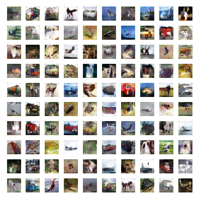

# ALI-tensorflow

[Adversarially Learned Inference](https://arxiv.org/abs/1606.00704) implemented by Tensorflow

## Run

```
# in repository root
python src/train.py -d your/data/dir/cifar-10-batches-py/ -e cifar10
```

# Result

Learned 281 Epoch

## Sample

Randam z -> Image




## Requirement

* Python 3
* TensorFlow >= 1.0.0
* tqdm
* matplotlib
